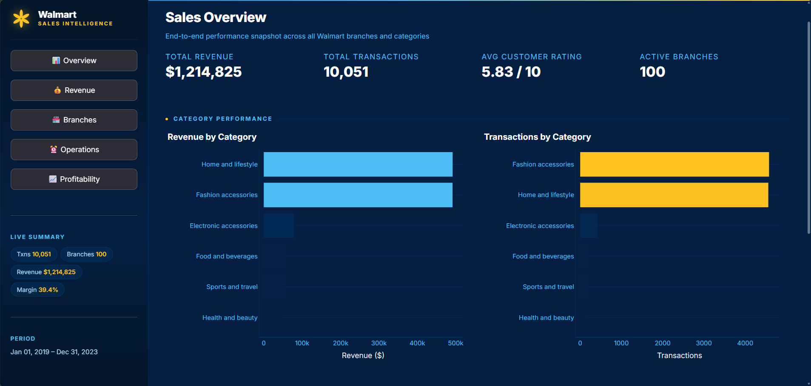

# Walmart Sales Intelligence Dashboard

End-to-end sales analysis on 10,000+ Walmart transactions using SQL, Python, Pandas and Streamlit — built with official Walmart brand colors.

## Dashboard Preview

### Overview



### Revenue Analysis


### Branch Intelligence


### Operational Analytics


### Profitability Intelligence


---

## Tools Used
- **Python** — Data processing and ML
- **MySQL** — 16 SQL queries (CTEs, Window Functions, CASE, YoY)
- **Pandas** — Data cleaning and transformation
- **Streamlit** — 5-page interactive dashboard
- **Plotly** — Interactive charts and heatmaps

## Dashboard Pages
| Page | What it shows |
|---|---|
| Overview | Revenue trends, category performance, 7-day moving average |
| Revenue | Payment breakdown, category × payment mix |
| Branches | City-level drill-down with dynamic filter |
| Operations | Peak hour analysis, shift revenue, demand heatmap |
| Profitability | Profit margins, bubble chart, rating vs revenue |

## Key Insights
- Identified peak transaction hours across 100 branches
- Found top-performing product categories by profit margin
- Analysed YoY revenue decline by branch
- Built heatmap showing category demand intensity by hour

## How to Run
```bash
git clone https://github.com/yourusername/walmart-sales-analytics
cd walmart-sales-analytics
pip install -r requirements.txt
streamlit run app.py
```

## Author
**Srishti Garg** | B.Tech ECE | TIET Patiala
[LinkedIn](https://www.linkedin.com/in/srishti-garg-150547254)
